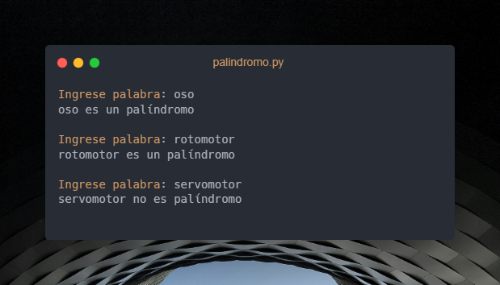

<p align="center">
    
</p>

<div align="center">

# Palindromo

[](https://expo.dev/)


</div>

<p align="center">
  ¿Si lo leo al revés dirá lo mismo? ¡Entonces es un palíndromo!
</p>

## Palíndromo

Un palíndromo es una palabra o una frase que se lee igual de adelante hacia atrás y de atrás hacia adelante. Es como un juego con las palabras.

## ¿Por Qué Son Especiales?

Los palíndromos son divertidos porque son como pequeños acertijos. Puedes intentar encontrar más en libros o inventar los tuyos propios.

### Algunos ejemplos:

> [!TIP]
> "Ana": Si lees "Ana" de izquierda a derecha o de derecha a izquierda, ¡es lo mismo!

> [!TIP]
> "oso": También se lee igual en ambos sentidos.

> [!TIP]
> "Anita lava la tina": Esta frase es un poco más larga, pero si la lees al revés, suena igual.

## Por hacer

- [X] Hacer algoritmo base para palabras.
- [X] Omitir espacios, puntos y comas al leer oraciones.
- [X] Interpretar la entrada como si todo estuviese en mayúsculas.
- [X] Hacer casos de pruebas.
    - [X] Casos de palabras que si son palíndromos.
    - [X] Casos de palabras que no son palíndromos.
    - [X] Casos de texto nulo (sin letras).
- [X] Documentación del proyecto.


## ¿Cómo ejecuto el programa?

Clona el repo.

```bash
   git clone https://github.com/Marfullsen/palindromo.git
```
Ve a la carpeta.

```bash
   cd palindromo/
```

Si ya tienes [Python 3](https://www.python.org/) instalado, ejecuta el siguiente comando.

```bash
   python palindromo.py
```

 Para ejecutar los casos de prueba ejecuta el siguiente comando.

```bash
   python raw_test_palindromos.py
```


## Screenshots

<p align="center">
    
</p>

## Referencias

- [Icon by Freepik](https://www.freepik.com/free-vector/illustration-switch-arrows_2606151.htm)
- SVG edited with [boxy-svg](https://boxy-svg.com/)
- [Alerts in Github Readmes](https://docs.github.com/en/get-started/writing-on-github/getting-started-with-writing-and-formatting-on-github/basic-writing-and-formatting-syntax#alerts)
- Photo by Kevin Lang on [Unsplash](https://unsplash.com/)